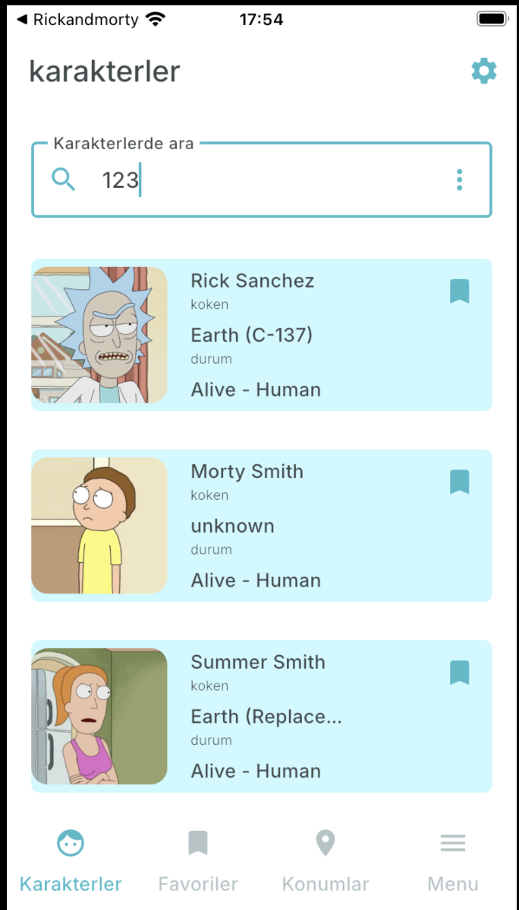
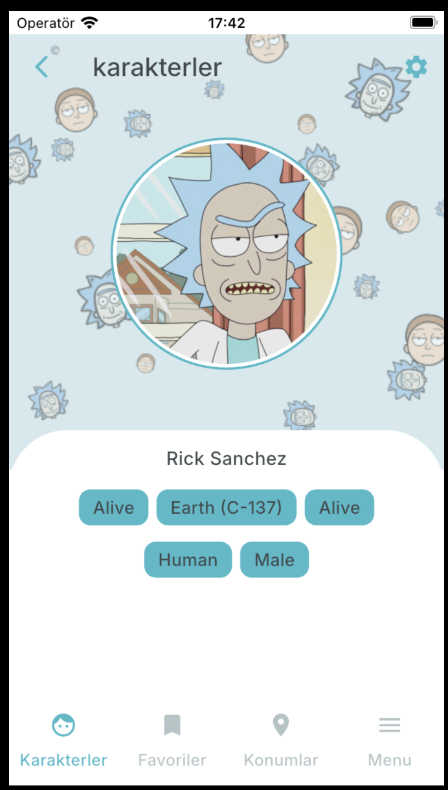
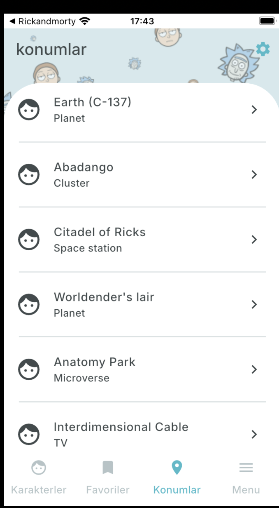
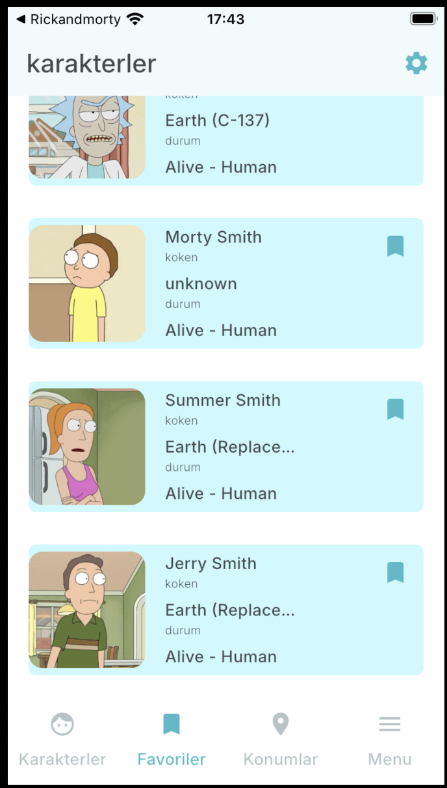
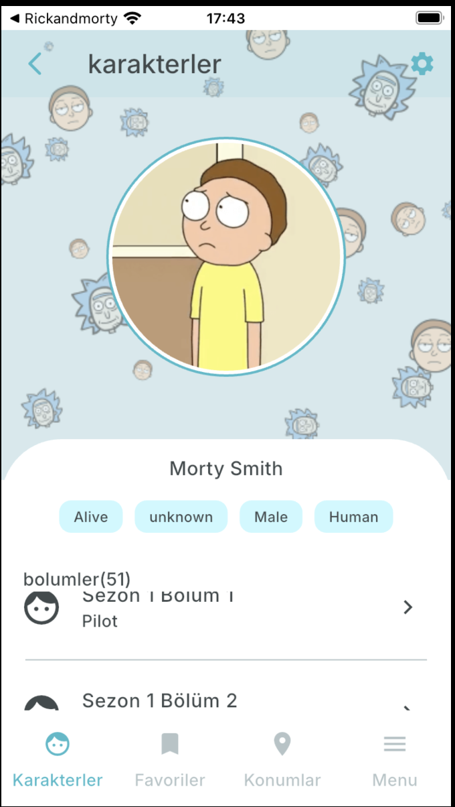
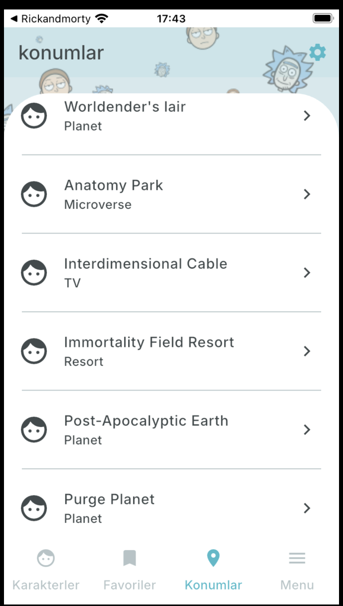

# Rick and Morty Explorer

A Flutter-based mobile application that allows users to explore characters, episodes, and locations from the Rick and Morty universe. Users can also mark their favorite characters and customize the app theme.

---

## 🖼️ Screenshots

<p align="center">
  
  
  
  
  
  
</p>

---

## 🚀 Features

- **Characters**: Browse all characters, search by name, view details, and add to favorites.
- **Episodes**: Explore all episodes of the series.
- **Locations**: View all the locations featured in the show.
- **Favorites**: Save and manage your favorite characters locally.
- **Details Pages**: Dedicated pages for character and episode details.
- **Pagination & Infinite Scrolling**: Seamless list navigation experience.
- **Theme Customization**: Light/dark mode and custom theme support.

---

## 🛠️ Technologies Used

- **Flutter** (Dart)
- **Provider** – State management
- **GoRouter** – Page navigation
- **Dio** – HTTP requests
- **Shared Preferences** – Local storage for favorites

---
## 📁 Project Structure

```plaintext
lib/
├── app/
│   ├── Theme/         # App theme and route settings (GoRouter)
│   └── View/          # Screens, widgets, and UI views
├── models/            # Models for data received from the API
├── service/           # API services and local storage logic
assets/                # Fonts and image assets
└── screenshots/       # App screenshots for documentation
